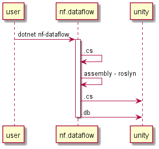
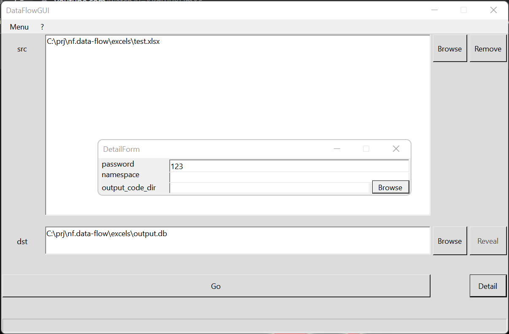
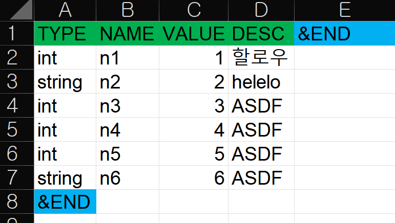
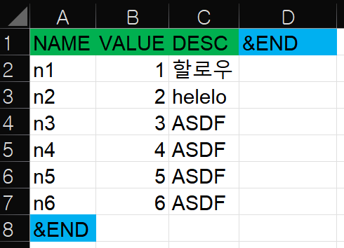
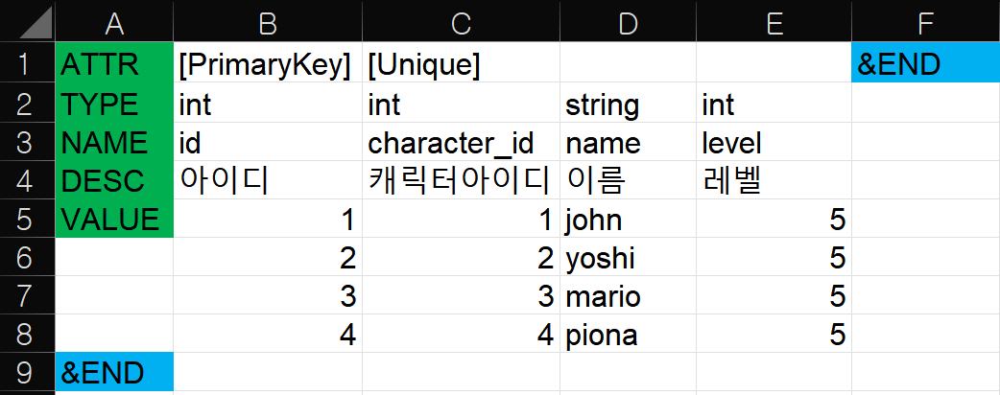

# nf.data-flow


[flow.puml](flow.puml)

## introduce

this is sample dataflow. When I making a game(in unity), I don't like to hard-coding for data class from excel. I'm writing custom class generator, and data exporter for that work with https://github.com/netpyoung/SqlCipher4Unity3D.

## Gui




## sheet







## example

``` cmd
$ rake --version
rake, version 13.0.6

$ dotnet --version
6.0.300

$ rake tool_install
$ rake dataflow
```

## Ref

- [Rakefile](https://github.com/ruby/rake)
- liquid
  - <http://dotliquidmarkup.org/>
  - <https://shopify.github.io/liquid/>
- [dotnet cli](https://www.microsoft.com/net/core)
- [Sqlite](https://www.sqlite.org/) && [Sqlcipher](https://www.zetetic.net/sqlcipher/)
- <https://github.com/sqlitebrowser/sqlitebrowser>
